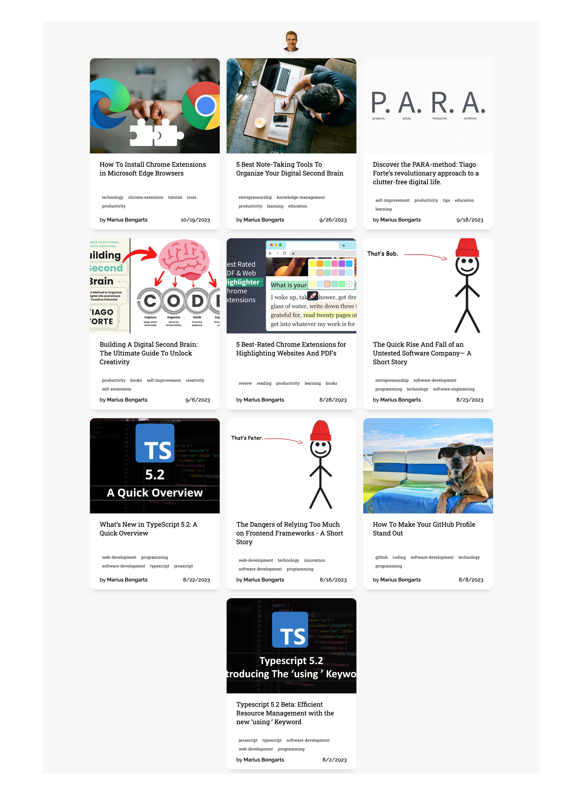

### Lit first steps

We build a blog porfolio with web components followin the article wrote by [Marcus Bongarts](https://medium.com/@mariusbongarts11/showcase-your-medium-articles-with-web-components-part-1-basics-d2c6618e9482)

In this repository we are going from de basics, starting creating our
web component with the native api, using javascript, next we included webpack
with typescript and finally we refactorice our component with Lit

### To run this project

```bash
npm install
```

```bash
npm run start
```

### Screenshots


